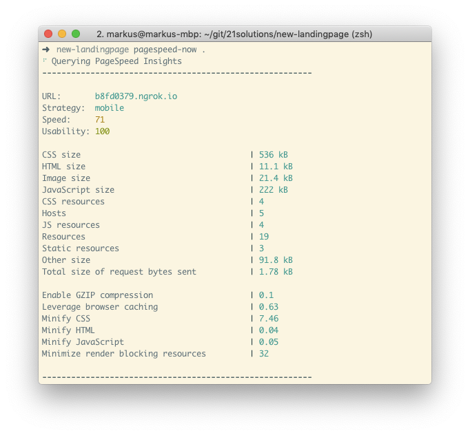

# pagespeed-now

> PageSpeed Insights for local (not-yet-deployed) sites - perfect during development



Thousands of web developers use [PageSpeed Insights](https://developers.google.com/speed/pagespeed/insights/) to analyze the performance of their websites. But: For a PageSpeed check, sites have to be deployed & be publicly accessible.

With `pagespeed-now`, you skip deployment. **Get PageSpeed results while your site is still on your local machine.**

## Install

```sh
$ npm install -g pagespeed-now
```

```sh
$ pagespeed-now --help

  Usage
    $ pagespeed-now <port|folder>
  Options
    --strategy   Strategy to use when analyzing the page: mobile|desktop (default: mobile)
  Examples
    $ pagespeed-now 3000
    $ pagespeed-now _site
    $ pagespeed-now .
    $ pagespeed-now 3000 --strategy=mobile
```

## Usage

### Port

```sh
$ pagespeed-now <port>

  Example
    $ pagespeed-now 3000
```

Specify the local port your website is running on. PageSpeed report for `localhost:<port>` will be generated.

### Folder

```sh
$ pagespeed-now <folder>

  Examples
    $ pagespeed-now _site
    $ pagespeed-now . # for current directory
```

Specify the folder path (relative or absolute to the current folder) to your website's contents. `pagespeed-now` will automatically spawn a local HTTP static-file server (gzip-enabled) on a random free port. PageSpeed report for this local static-file server will be generated.

### Flags

#### --strategy

Strategy to use when analyzing the page: `mobile|desktop` (default: `mobile`)

## Behind the Scenes

This tool generates a temporary public URL for your local webserver with [ngrok](https://ngrok.com) (`<random>.ngrok.io`). Then, it requests a PageSpeed Insights analysis on this public URL. The public URL is discarded when `pagespeed-now` has finished.

## Author

Markus Dosch - [markusdosch.com](https://markusdosch.com)
